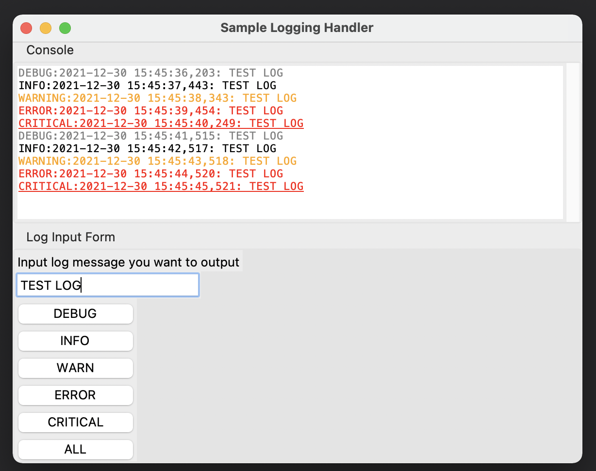

# sample-tkinter-log-output


This is a sample output of the log on tkinter.  
It refers to this post: https://beenje.github.io/blog/posts/logging-to-a-tkinter-scrolledtext-widget/

## Usage

```sh
python main.py
```